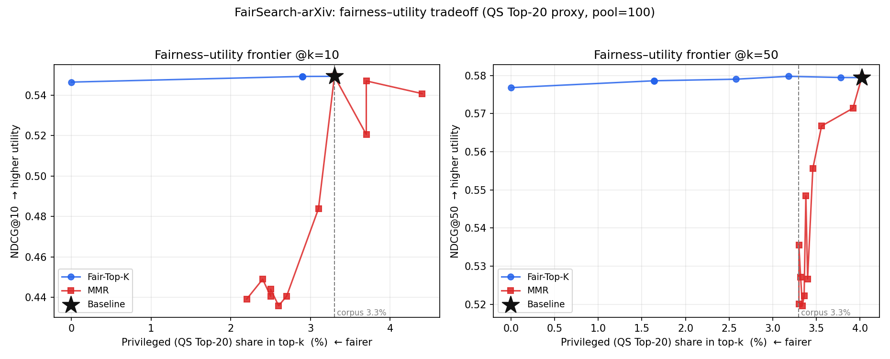

# FairSearch-arXiv

*Evaluating and mitigating bias in academic Retrieval-Augmented Generation (RAG)*


## What this project is about

When you search academic papers with a modern RAG system — a dense retriever that
finds papers, plus an LLM that reads them and writes a cited answer — the retriever
learns from a body of literature that already over-represents large, well-resourced,
high-prestige institutions. So it could quietly surface those papers more often,
making work from smaller or less-resourced institutions harder to find.

**FairSearch-arXiv** measures whether that actually happens, and tries to fix it. We
build a RAG pipeline over a 50,000-paper sample of the arXiv corpus, label each paper
by the prestige of its first-author institution, and then ask three questions:

1. **Does retrieval favour high-prestige institutions?** (retrieval bias audit)
2. **Does the LLM's cited answer over-rely on those same sources?** (generative faithfulness)
3. **Can we rebalance results without wrecking search quality?** (mitigation)

This repo is coursework for **CS 6200 — Information Retrieval**, Northeastern
University.

## Team

| Member | Focus |
|--------|-------|
| Aarushi Kaushik | Retrieval & indexing (SPECTER2 / MiniLM, FAISS) |
| Pavani Jain | Corpus enrichment, demographic mapping, fairness evaluation |
| Pratyush Tyagi | Bias mitigation (Fair-Top-K re-rank, MMR, fair prompting) |
| Shweta Pattanaik | Streamlit interface, demo, integration |

---

## Where the project is right now

Built bottom-up in four stages. The first three are **done with results**; the
generation-faithfulness study and the demo are the remaining work.

### 1. Data — cleaned, sampled, enriched *(done)*

- **Read the whole corpus.** Streamed the full arXiv metadata dump —
  **3,080,258 records, 0 parse errors** — and checked field coverage (DOIs exist on
  only ~43% of papers, so we don't rely on DOI alone).
- **Deduplicated it** by id, DOI, and title → **3,071,765 unique records**.
- **Sampled 50,000 papers** with a fixed seed (`seed=42`) so anyone regenerates the
  same set.
- **Added institution affiliations** from two open sources — **Semantic Scholar**
  (by arXiv id) and **OpenAlex** (by DOI) — resolving **49,652 / 50,000 papers
  (99.3%)**. About **20,924** carry a clean first-author institution across
  **3,473 distinct institutions**.

### 2. Prestige labels *(done)*

Every paper carries a first-author-institution prestige label, so the fairness
analysis has two groups to compare. We use **two** definitions and report the audit
on both:

- **`proxy_group` (QS Top-20) — the primary group.** From an external ranking
  (QS World University Rankings 2026): `Privileged` if the first-author institution
  is a global **Top-20** university, else `Underrepresented`. This tags **1,638
  papers Privileged (3.30%)** and **48,014 Underrepresented**. The 20 elite schools
  present include Berkeley, Cambridge, Caltech, ETH Zürich, Oxford, MIT, Harvard,
  Peking, Stanford, Cornell, Imperial, Tsinghua, NUS, UCL, Chicago, UPenn, NTU,
  Melbourne, UNSW, and HKU. This matches the assignment's "Privileged (Top-20
  institutions) vs. Underrepresented" definition. Built for the full corpus by
  `10_build_proxy_labels.py`.
- **`top_uni` (citation-based) — a robustness check.** The first-author institution
  is among the **top 50 by mean citations** in our own sample. This flags **1,182
  papers (2.38%)** and is fully data-driven from the corpus (no external ranking).
  We keep it because it operationalizes "elite" a different way; the audit
  conclusions hold under both.

> **What these labels mean.** They describe the *institution*, from the *first
> author's* affiliation only — never an individual person's background. A top-tier
> affiliation doesn't make someone "privileged," and being off a ranked list doesn't
> make someone "underrepresented" (most of the world's ~25,000+ universities are
> never ranked). We use these for **corpus-level** analysis of what shows up in
> search, not for judgements about people.

> **Two honest caveats on the QS label.** (1) The bundled QS file resolves the full
> **Top-20** set (all 20 elite institutions are present, so the binary
> Privileged/Underrepresented split is faithful), but it does **not** populate the
> finer tiers (top50/top100/…) — those collapse into `unranked`. That only affects
> gradations *within* the Underrepresented group, not the Top-20 contrast we audit.
> (2) The institution normalizer collapses all University of California campuses to
> one key, so "Berkeley" (339 papers) really means system-wide UC — a small upward
> bias on the Privileged count.

### 3. Retrieval + bias audit + mitigation *(done)*

**Retrieval quality.** A MiniLM-L6-v2 FAISS index over all 49,652 papers retrieves
with precision **0.628 / 0.589 / 0.572** at k = 1 / 5 / 10 (1,000-query test,
same-category relevance). SPECTER is the stronger encoder used for the fairness
study; its document embeddings are materialized over the full corpus (49,652 × 768).

**The bias audit (RQ1).** Over 100 known-item queries we measured how often
Privileged (QS Top-20) papers reach the Top-k, using **Statistical Parity Difference
(SPD)** and **Equalized Odds (EO)** with 1,000-sample bootstrap CIs.

> **Headline finding: retrieval tracks corpus prevalence at the top — no meaningful
> parity gap at k=10, a mild elite skew deeper.** Privileged papers are 3.30% of the
> corpus and fill exactly **3.30% of the Top-10** (SPD ≈ 0, 95% CI spans zero;
> EO ≈ 7e-4). By Top-100 their share rises to **3.59%** with SPD +1.8e-4 and EO
> ~0.012 — a small over-representation that appears below the very top ranks. The
> `top_uni` robustness check gives the same qualitative picture.

**Mitigation (RQ3).** We re-ranked the SPECTER Top-50 pool with **MMR** (diversity,
λ swept over {0.3, 0.5, 0.7}, best λ = 0.7 by an NDCG-weighted composite) and
**Fair-Top-K** (a DetGreedy floor quota guaranteeing a minimum share of
Underrepresented papers in every prefix), then measured the utility cost with
**NDCG@10** and **MRR** alongside the fairness metrics.

| Method (SPECTER) | k | NDCG@k | MRR | P@k | Privileged share | SPD | EO |
|---|:--:|:--:|:--:|:--:|:--:|:--:|:--:|
| Baseline | 5 | 0.565 | 0.697 | 0.554 | 2.8% | ≈0 (CI spans 0) | 0.0004 |
| Baseline | 10 | 0.556 | 0.697 | 0.536 | 3.3% | ≈0 (CI spans 0) | 0.0007 |
| MMR (λ=0.7) | 5 | 0.523 | 0.702 | 0.504 | 2.0% | ≈0 | 0.0015 |
| MMR (λ=0.7) | 10 | 0.534 | 0.702 | 0.515 | 3.9% | ≈0 | 0.0028 |
| **Fair-Top-K** | 5 | **0.565** | **0.697** | **0.554** | 2.8% | ≈0 | 0.0004 |
| **Fair-Top-K** | 10 | **0.556** | **0.697** | **0.536** | 2.9% | ≈0 | 0.0006 |

> **The fairness–utility trade-off, in one line:** **Fair-Top-K is effectively free** —
> it nudges the elite share below the corpus base rate (3.3% → 2.9% at k=10) with
> **zero** loss in NDCG@10 (0.556), MRR (0.697), or precision, because it only demotes
> the handful of elite papers that crack the top ranks and promotes equally-relevant
> non-elite papers already in the pool (4/100 rankings change). **MMR pays ~4% of
> NDCG@10** (0.556 → 0.534) and, being a diversity objective rather than a fairness
> one, moves the elite share *inconsistently* (down to 2.0% at k=5 but up to 3.9% at
> k=10) — so it is not a reliable institutional-fairness lever here.

**The fairness–utility frontier** (`12_fairness_utility_tradeoff.py` →
`fairness_utility_pareto.png`) sweeps each re-ranker's control knob (MMR λ ∈ [0,1];
Fair-Top-K's representation target ∈ [0,1]) and plots NDCG@k against elite share.
**Fair-Top-K Pareto-dominates MMR:** it can drive the Privileged share all the way to
**0% at only −0.003 NDCG** (both k=10 and k=50), tracing a near-horizontal frontier,
while MMR loses up to ~0.11 NDCG@10 *without even reaching parity*. So the fairness
lever we ship is not just cheap at one setting — it is cheap across the entire
operating range, and strictly better than the diversity baseline.



### 4. Generative faithfulness + demo *(next)*

RQ2 — whether Llama-3-8B-Instruct's cited answers over-rely on consensus/elite
sources, scored with a **Pro-Consensus vs. Dissenting** citation-token ratio and an
**LLM-as-a-judge** setup (plus RAGAS) — and the Streamlit demo are the remaining
pieces.

---

## How it fits together

```
arXiv metadata dump ─> inspect ─> dedup + sample (seed=42) ─> sample_50k.jsonl
                                                                   │
        enrich (OpenAlex by DOI) ┐                                 │
        enrich (Semantic Scholar) ┴─> rank + finalize ─> final_enriched.jsonl
                                                                   │
   demographic enrich (QS join, 07) ─> institution_ranking_enriched.csv          │
   proxy labels for full corpus (10) ─> proxy_labels.csv (Privileged/Underrep)    │
                                                                   │
                          build RAG index (MiniLM / SPECTER) ──────┘─> FAISS index + specter_doc_emb.npy
                                    │
                   ┌────────────────┼──────────────────────────────┐
            retrieval audit    cited generation              re-ranking
            SPD, Eq.Odds       (Llama-3 + LLM judge)          MMR, Fair-Top-K
            NDCG@10, MRR                                      NDCG@10, MRR
            (08 top_uni;       [next]                         (09 top_uni;
             11 QS Top-20)                                     11 QS Top-20)
              [done]                                            [done]
```

---

## Try it yourself

### Install

```bash
git clone https://github.com/PratyushTyagi/IR-FairSearch-arXiv-Team6.git
cd IR-FairSearch-arXiv-Team6
pip install -r requirements.txt
```

A GPU helps a lot — encoding 50K papers takes minutes on GPU vs an hour-plus on
CPU/MPS. The generation step uses Llama-3-8B-Instruct, a gated Hugging Face model, so
run `huggingface-cli login` once first.

> The re-ranking + audit-recompute steps (`09`, `10`, `11`, `verify_1_8_integrity`)
> reuse cached retrieval and embeddings, so they run on **CPU with only `numpy` +
> `pandas`** — no GPU, FAISS, or model download needed.

### Get the data

```bash
pip install kaggle
kaggle datasets download -d Cornell-University/arxiv -p data --unzip
# yields data/arxiv-metadata-oai-snapshot.json  (~5 GB, CC0, refreshed weekly)
```

### Run the pipeline

```bash
python 01_inspect.py                     # scan + validate the raw dump, field coverage
python 02_dedup_sample.py                # dedup (id/DOI/title) + reproducible 50K sample
python 04_enrich.py                      # affiliations: OpenAlex (DOI) + Semantic Scholar (id/title)
python 05_rank_and_finalize.py           # canonical institution keys + ranking -> final_enriched.jsonl
python 07_demographic_enrich.py \        # QS prestige proxy -> institution_ranking_enriched.csv
  --ranking data/qs_world_university_rankings_2026.csv --source QS-2026 --n 1501 \
  --elite-rank 20
python 06_rag_baseline.py                # MiniLM encode + FAISS index + retrieval eval

# --- Fairness audit + mitigation (CPU-only from cached artifacts) ---
python 08_specter_fairness_baseline.py   # SPECTER audit on top_uni: SPD, Equalized Odds, bootstrap CIs
python 09_rerank_fairness.py             # MMR + Fair-Top-K on top_uni (robustness check)
python 10_build_proxy_labels.py          # materialize QS Top-20 Privileged labels for all 49,652 docs
python 11_proxy_fairness_and_rerank.py   # PRIMARY: audit + MMR + Fair-Top-K on QS Top-20, with NDCG@10 + MRR
python verify_1_8_integrity.py           # integrity checks on the baseline artifacts
```

### Fairness Scorecard demo (Streamlit)

An interactive per-query fairness diagnostic. Pick one of the 100 audit queries,
choose **Baseline** / **Fair-Top-K** / **MMR**, and read the scorecard (Privileged
share, SPD, NDCG@k, Precision@k) with the ranked results tagged by institution
group. Fair-Top-K's representation target is a live slider — drag it and watch the
elite share fall while NDCG barely moves.

```bash
pip install streamlit
python make_scorecard_data.py     # one-time: build the small display file (needs data/)
streamlit run app.py              # from the repo root
```

It runs from small cached files only (`scorecard_docs.csv`,
`specter_retrieved_topk.csv`, `queries_100.jsonl`) — no GPU, model, or LLM key.

Everything keys off a fixed `seed=42`, and each step writes a self-contained file, so
the whole thing regenerates end-to-end from the raw snapshot. You can swap the ranking
source (`--source THE-2026 --n 2191`, `--source ARWU --n 1000`) — just don't mix
sources in one run.

---

## Repository layout

```
IR-FairSearch-arXiv-Team6/
  README.md
  requirements.txt
  01_inspect.py                    # stream + validate the raw dump, field coverage
  02_dedup_sample.py               # dedup (id/DOI/title) + reproducible 50K sample
  04_enrich.py, 04a_*, 04b_*       # affiliation enrichment (OpenAlex + Semantic Scholar)
  05_rank_and_finalize.py          # canonical institution keys + ranking + final_enriched
  06_rag_baseline.py               # MiniLM encode + FAISS index + retrieval eval
  07_demographic_enrich.py         # QS join -> prestige tiers + Privileged/Underrep proxy
  08_specter_fairness_baseline.py  # SPECTER audit on top_uni: SPD + Equalized Odds (steps 1-8)
  09_rerank_fairness.py            # MMR + Fair-Top-K on top_uni (steps 9-17)
  10_build_proxy_labels.py         # QS Top-20 Privileged labels for the full corpus
  11_proxy_fairness_and_rerank.py  # PRIMARY audit + mitigation on QS Top-20 (+ NDCG@10, MRR)
  verify_1_8_integrity.py          # 30 integrity checks on the baseline artifacts
  openalex_client.py, s2_client.py # API clients for enrichment
  generate.py                      # (next) cited answers (Llama-3) + LLM-as-a-judge
  data/                            # snapshot + sample + enriched + indexes  (large files gitignored)
```

Key result files (produced in `data/`): `rag_eval.csv` (retrieval quality);
`baseline_bias_scores_proxy20.json` + `fairness_per_query_proxy20.csv` (RQ1 audit,
QS Top-20); `comparison_table.csv` + `rerank_bias_scores.json` (RQ3 mitigation,
QS Top-20, with NDCG@10/MRR); `mmr_lambda_sweep.csv` (λ selection);
`proxy_labels.csv` (per-paper Privileged/Underrep). The `*_topuni_citation.*` files
are the citation-based robustness variants. The demographic layer emits
`institution_ranking_enriched.csv`, `university_global_ranking_normalized.csv`, and
`demographic_enrichment_summary.txt`.

---

## What's left

- Run the **generation** step (RQ2): Llama-3-8B cited answers, Pro-Consensus vs
  Dissenting citation-token analysis, LLM-as-a-judge scoring, and RAGAS.
- Ship a **Streamlit** demo with a fairness toggle, plus the final report and slides.
- Optionally load a **full** QS export to populate the finer prestige tiers (not
  needed for the binary Top-20 audit, but useful for tier-sliced analysis).

## Data & license

arXiv metadata is distributed under **CC0** via the Cornell-University/arxiv Kaggle
dataset. Affiliations come from **OpenAlex** and **Semantic Scholar** (openly
licensed). Coursework for CS 6200 — Information Retrieval, Northeastern University.